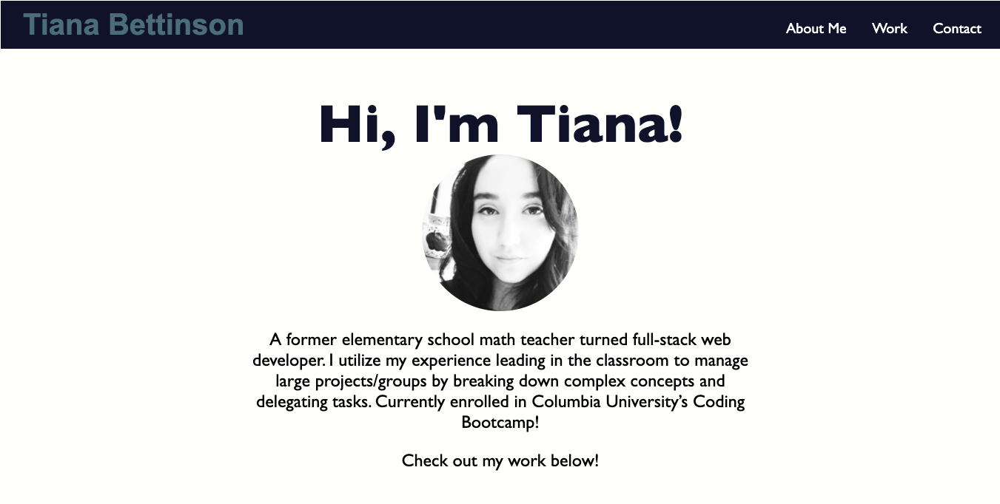

# Portfolio
A current portfolio showcasing my work
[Link to Website](https://tbetti.github.io/Portfolio/)

<h2>Description</h2>
This webpage showcases a portfolio of websites and applications I have worked on. It also links to my current resume and provides ways to contact me through GitHub, LinkedIn, and Email.  Options in the header menu link to various parts of my webpage.  The page adapts to various screen sizes.

<figure>
    
    <figcaption>Mobile View via GIPHY</figcaption>
</figure>

<h2>Technologies Used</h2>
  <ul>
    <li>HTML</li>
    <li>CSS</li>
    <li>JavaScript</li>
    <li>jQuery</li>
  </ul>
  
<h2>Contact Creator</h2>
<ul>
    <li><b>Email:</b> tiana.bettinson@gmail.com</li>
    <li><b>LinkedIn: </b><a href="https://www.linkedin.com/in/tianabettinson/">linkedIn.com/in/TianaBettinson</a></li>
</ul>
<h2>License</h2>

View the <a href="./License">MIT License</a> here

